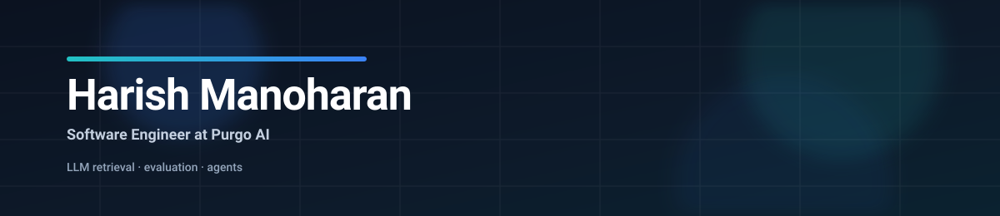

  

  <a href="https://harishm17.github.io">Portfolio</a> ·
  <a href="https://linkedin.com/in/harishm17">LinkedIn</a> ·
  <a href="mailto:harish_manoharan@outlook.com">Email</a>

Software Engineer at **Purgo AI** in the San Francisco Bay Area. I build retrieval and evaluation for the LLM agent that turns data engineering tickets into Databricks and dbt code.

## Recent results at Purgo AI

- **70% fewer missed source tables** after adding dbt lineage to the agent's table retrieval (103-ticket benchmark)
- **Semantic table search on Pinecone** that finds 26% more of the right tables, about 20x faster than the existing search (188 real queries)
- **7.6x cheaper retrieval and drafting** at the same recall, chosen after a five-run, 102-ticket model comparison
- **Purgo's LLM validation product**: 19 tests and 100+ checks for hallucination, accuracy, bias, determinism and traceability

Most of this lives in private repos. The public part is [PurgoAI/iqoq-testcases](https://github.com/PurgoAI/iqoq-testcases), the Databricks IQ/OQ test library I wrote (59 tests in 17 suites, Azure and AWS).

## Projects

<table>
  <tr>
    <td width="50%" valign="top">
      <b><a href="https://github.com/harishm17/study_buddy">StudyBuddy</a></b> 
      Exam prep from course PDFs: pgvector retrieval, generated quizzes and graded exams, and a real-time voice coach on the OpenAI Realtime API.
    </td>
    <td width="50%" valign="top">
      <b><a href="https://github.com/harishm17/task-manager">DivvyDo</a></b> 
      Roommate expense splitting with five split methods and integer-cents rounding that always adds up. Supabase with row-level security.
    </td>
  </tr>
  <tr>
    <td width="50%" valign="top">
      <b><a href="https://github.com/harishm17/smart_email">Email Drafting Assistant</a></b> 
      Turns a plain-language request into a Gmail draft, with PII scrubbed before any text reaches the model.
    </td>
    <td width="50%" valign="top">
      <b><a href="https://github.com/harishm17?tab=repositories">More</a></b> 
      Coursework, experiments and older projects.
    </td>
  </tr>
</table>

## Stack

**Languages:** Python, TypeScript, SQL 
**LLM and agents:** LangGraph, LangChain, OpenAI, Anthropic, Gemini, Langfuse, PyTorch 
**Data:** Databricks, dbt, PySpark, PostgreSQL, pgvector, Pinecone, Apache Iceberg 
**Backend and web:** FastAPI, NestJS, Next.js, React 
**Infra:** GCP (Cloud Run, Cloud Tasks), Docker, GitHub Actions

MS in Computer Science, UT Dallas (2026) · Dual degree in Data Science and Biological Sciences, IIT Madras
